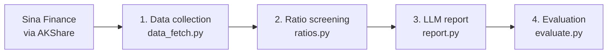

# A-Share Financial Fraud Risk Skill

An LLM-powered pipeline that turns raw financial statements into an evidence-based fraud risk report for Chinese A-share companies — and automatically evaluates whether the AI's output is correct and grounded.

**Case study:** Kangmei Pharmaceutical (康美药业, 600518), one of the largest accounting frauds in A-share history (~¥30bn of cash overstated), benchmarked against Yunnan Baiyao (云南白药, 000538) as a normal industry peer.

## Pipeline



| Module | What it does |
|---|---|
| `data_fetch.py` | Downloads balance sheet, income statement and cash flow statement (20+ years) |
| `ratios.py` | Computes the Beneish M-Score plus China-specific red flags and applies a rule engine |
| `report.py` | Sends indicators and flags to an LLM with a structured prompt; outputs a 6-section risk report |
| `evaluate.py` | Checks the report's risk rating against ground truth and verifies every quoted number against the input data |

## Key Findings

**1. The classic Beneish M-Score missed the fraud.** During Kangmei's peak fraud years (2013–2016) its M-Score stayed between -2.55 and -2.91, below the -2.22 warning threshold. Meanwhile Yunnan Baiyao crossed the threshold in 2013, 2015 and 2018 — false positives. The model is designed for revenue and receivables manipulation, whereas Kangmei's core scheme was **fictitious cash**, which the M-Score does not capture.

**2. China-specific indicators caught it.** I added red flags targeting cash fabrication, a common pattern in A-share fraud cases:

| 2012–2016 | Kangmei | Yunnan Baiyao |
|---|---|---|
| Cash / total assets | 34% – 50% | 12% – 16% |
| Interest-bearing debt / total assets | 21% – 30% | 0% – 7% |
| Net cash (¥bn) | 0.7 → 14.2 | 1.1 – 2.1 |
| Financial costs / revenue | 2.5% – 3.3% | 0.0% – 0.4% |
| Red flags per year (2012–2017) | 2 – 3 | 0 – 2 |

A company holding ¥14bn more cash than debt should earn net interest income, yet Kangmei paid financial costs of over 3% of revenue. When the fraud was corrected, cash/assets collapsed from 49.8% (2016) to 6.4% (2017) and net cash swung to -¥15.5bn — the "hidden" debt was real, the cash was not.

**3. Iterating on false positives.** The first version of the rules flagged Yunnan Baiyao almost as often as Kangmei. Adding a materiality threshold (financial costs > 1% of revenue) and using a 3-year cash-flow ratio instead of single years cut the peer's flags to mostly 0–1 per year.

## Evaluation Results

| Company | Expected | LLM rating | Correct | Numbers quoted | Grounded in input data |
|---|---|---|---|---|---|
| Kangmei | High | High | ✅ | 89 | 100% |
| Yunnan Baiyao | Low / Medium | Medium | ✅ | 73 | 100% |

The evaluator itself was iterated: its first version reported only 90% grounding for Yunnan Baiyao, but manual review showed the "ungrounded" figures were section numbers (e.g. "2.1") and ratios the LLM had converted to percentages (0.208 → 20.8%). After fixing both cases, deliberately fabricated numbers are still detected.

Full reports: [`reports/sh600518_report.md`](reports/sh600518_report.md) · [`reports/sz000538_report.md`](reports/sz000538_report.md)

## Quick Start

```bash
conda create -n fraud python=3.12 -y
conda activate fraud
pip install -r requirements.txt

cp .env.example .env          # then add your own API key
python src/data_fetch.py      # 1. download statements
python src/ratios.py          # 2. compute indicators and red flags
python src/report.py          # 3. generate LLM reports
python src/evaluate.py        # 4. evaluate the reports
```

Works with any OpenAI-compatible API (DeepSeek, Qwen, GLM, OpenAI). Without an API key, `report.py` still saves the full prompt for review.

## Limitations

- **Small sample.** Two companies only, and the rule thresholds were tuned on this same sample, so the results show the approach works rather than proving it generalises.
- **Not a true early-warning test.** The fraud became public in 2019, and the data source reflects restated figures for 2017. A proper test would give the model only data available at the time.
- **5-variable M-Score.** The data source does not disclose depreciation, so DEPI cannot be computed and Beneish's 5-variable model is used instead of the 8-variable version.
- **Single LLM run.** LLM output varies between runs; evaluation should be repeated across several runs.

## Roadmap

- [ ] Point-in-time backtest: feed only data up to 2016 and test whether the risk is flagged before exposure
- [ ] Expand to more confirmed fraud cases (e.g. 康得新, 獐子岛, 乐视网) with matched peers
- [ ] Package as a reusable Skill with a standard input/output interface
- [ ] Add an LLM "reviewer" agent that critiques the first report before final output

## Author

**Junwei (Will) Huangfu** · Master of Professional Accounting @ ANU · B.Com (Finance & Banking) @ University of Adelaide

*This project is for research and educational purposes only and does not constitute investment advice.*